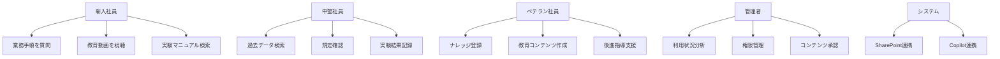

# 要件定義書 - ビックケミー・ジャパン株式会社 チャットボット開発プロジェクト

## 1. プロジェクト概要

### 1.1 プロジェクト名
**社内ナレッジ共有・業務効率化チャットボットシステム**

### 1.2 目的
**ビジネス目標:**
- 業務効率化の実現
- 生産性向上
- 新人教育・引継ぎ工数の削減
- 作業の属人化解消
- 製品知識の理解度統一によるアウトプット品質向上

**解決したい課題:**
- マニュアル整備・ナレッジ共有の不備による新人教育の長期化
- 定年退職予定者（全体の10%）の知識継承問題
- オペレーション統一化の遅れ
- 業務の属人化による業務継続リスク
- 繰り返し問い合わせによる業務時間の非効率
- 1,000種類を超える製品知識の社員間格差

### 1.3 スコープ
**【フェーズ1】対象範囲（本プロジェクト）:**
- 社内マニュアル・規定の体系化と検索システム
- 基本的なファイル管理・アップロード機能（手動）
- チャットボットによる問い合わせ対応（AI型）
- 段階的展開（尼崎拠点10名→他拠点30名→全社50名）
- 基本的な権限管理とアクセス制御
- 利用状況の分析・効果測定機能

**明確に除外する事項:**
- **Excel実験データ処理**（技術的複雑性のため将来検討）
- **SharePoint自動連携**（手動アップロード運用で対応）
- **OCR機能**（紙媒体は事前電子化で対応）
- **動画コンテンツ管理**（文書ベースのナレッジに集中）
- **多言語対応**（フェーズ1は日本語のみ）
- **モバイル対応**（PC利用前提）
- **社外顧客向けサポート**
- **販売代理店との情報共有**

### 1.4 ステークホルダー
- **プロジェクトオーナー**: 技術部署（研究テクニカルセンター）
- **承認者**: 尼崎拠点統括者、日本拠点代表取締役社長
- **主要ユーザー**: 尼崎拠点研究テクニカルセンター従業員（10名）
- **将来ユーザー**: 全日本拠点従業員（50名）
- **システム管理者**: 社内IT管理者（詳細要確認）
- **海外本社**: ALTANAグループ（ドイツ本社・承認・ガバナンス）

### 1.5 成功指標
- **教育時間削減率**: 新人教育・引継ぎ時間を30%削減
- **問い合わせ削減**: 同じ質問の重複を50%削減
- **ナレッジ蓄積**: 半年で200件以上のナレッジ登録
- **ユーザー利用率**: 月間アクティブユーザー率80%以上
- **検索成功率**: 求める情報の検索成功率90%以上

## 2. ターゲットユーザー・ペルソナ

### 2.1 ユーザー分類
**主要ユーザー:**
- 新入社員・中途入社者
- 中堅社員（業務マニュアル参照）
- ベテラン社員（ナレッジ登録・共有）

**副次ユーザー:**
- 管理職（進捗確認・承認）
- 他拠点従業員（将来的）

**管理者:**
- システム管理者
- コンテンツ管理者

### 2.2 ペルソナ定義
**ペルソナ1: 新入社員（田中さん）**
- 年齢: 25歳、入社1年未満
- 課題: 業務手順が分からず、毎回先輩に質問している
- 利用目的: 基本的な業務手順の確認、実験手順の学習、機器操作マニュアルの検索
- デバイス: 社用PC（Windows）、社用携帯（iOS）
- 具体的シーン: 海外出張の旅費精算方法、分析機器の使い方確認

**ペルソナ2: ベテラン社員（佐藤さん）**
- 年齢: 55歳、勤続25年、5年後定年退職予定
- 課題: 長年の経験・ノウハウを後進に伝える時間が不足
- 利用目的: ナレッジの登録・共有、過去の実験データ検索
- デバイス: 社用PC（Windows）
- 具体的シーン: 実験レポートのデジタル化、技術資料の共有

### 2.3 ユーザージャーニーマップ
**新入社員の利用シナリオ:**
1. 業務で分からないことが発生
2. チャットボットで質問を入力
3. 関連マニュアル・動画を提示される
4. 詳細な手順を確認して業務実行
5. 追加質問があれば再度チャットボットに質問

### 2.4 利用環境
- **デバイス**: Windows PC、iOS端末
- **ブラウザ**: 指定なし（主要ブラウザ対応）
- **ネットワーク**: 社内ネットワーク
- **利用場所**: オフィス、実験室、外出先

## 3. 機能要件

### 3.1 機能要件一覧（フェーズ1）
| 機能ID | 機能名 | 優先度 | 概要 |
|--------|--------|--------|------|
| REQ-F-001 | チャットボット対話機能 | Must | AI型自然言語での質問・回答 |
| REQ-F-002 | ファイル検索機能 | Must | Word/PDF文書の全文検索 |
| REQ-F-003 | 情報蓄積機能 | Must | ナレッジの手動登録・更新・管理 |
| REQ-F-004 | 閲覧ログ管理機能 | Must | ユーザーアクセス履歴・効果測定 |
| REQ-F-005 | 権限管理機能 | Must | ユーザー別・コンテンツ別アクセス制御 |

### 3.2 除外機能（将来検討事項）
| 機能ID | 機能名 | 除外理由 |
|--------|--------|----------|
| REQ-F-101 | Excel実験データ処理 | 技術的複雑性・投資対効果不明 |
| REQ-F-102 | 動画コンテンツ管理 | 文書ベースに集中 |
| REQ-F-103 | OCR機能 | 運用で対応可能 |
| REQ-F-104 | 多言語対応 | 日本語で十分効果測定可能 |
| REQ-F-105 | モバイル対応 | PC利用で十分 |
| REQ-F-106 | SharePoint自動連携 | 手動運用で十分 |

### 3.3 機能要件詳細

#### REQ-F-001: チャットボット対話機能
- **概要**: ユーザーが自然言語で質問を入力し、適切な回答を返すAI型チャットボット機能
- **詳細仕様**:
  - 入力条件: テキスト入力（日本語のみ）
  - 処理内容: 
    1. 質問内容の解析・分類
    2. 関連文書・データの検索
    3. 回答候補の生成・ランキング
    4. 回答の表示（テキスト・関連文書リンク）
  - 出力結果: 回答テキスト、関連文書リンク
  - 例外処理: 回答不明時は管理者への問い合わせ案内
- **優先度**: Must
- **受入条件**: 
  - 基本的な業務質問（旅費精算、機器操作等）に対して80%以上の適切な回答
  - レスポンス時間3秒以内
- **関連機能**: REQ-F-002（検索機能）、REQ-F-003（情報蓄積）

#### REQ-F-002: ファイル検索機能
- **概要**: Word、PDF文書の全文検索とメタデータ検索
- **詳細仕様**:
  - 入力条件: 検索キーワード、ファイル種別、日付範囲
  - 処理内容:
    1. キーワードマッチング（部分一致・完全一致）
    2. ファイル内容の全文検索（Word/PDF中心）
    3. メタデータ検索（作成者、更新日時、カテゴリ）
    4. 検索結果のスコアリング・ソート
  - 出力結果: 検索結果リスト、プレビュー表示
  - 例外処理: 検索結果0件時の関連キーワード提案
- **優先度**: Must
- **受入条件**:
  - 登録ファイル対象の検索を5秒以内で完了
  - 関連度の高い結果が上位表示される
- **関連機能**: REQ-F-001（チャットボット）、REQ-F-003（情報蓄積）

#### REQ-F-003: 情報蓄積機能
- **概要**: ナレッジ・マニュアルの手動登録・更新・管理機能
- **詳細仕様**:
  - 入力条件: 文書ファイル（Word/PDF）、カテゴリ、タグ、権限設定
  - 処理内容:
    1. ファイルアップロード・変換（手動）
    2. メタデータ付与（カテゴリ、タグ、説明）
    3. バージョン管理
    4. 承認ワークフロー（必要に応じて）
  - 出力結果: 登録完了通知、公開状況表示
  - 例外処理: ファイル形式エラー、容量制限エラー
- **優先度**: Must
- **受入条件**:
  - Word、PDF形式の対応
  - 同時編集の排他制御
  - ファイル管理画面の直感的操作性
- **関連機能**: REQ-F-005（権限管理）、REQ-F-002（検索機能）

#### REQ-F-004: 閲覧ログ管理機能
- **概要**: ユーザーのシステム利用状況を記録・分析し、効果測定を行う機能
- **詳細仕様**:
  - 入力条件: ユーザーアクション（ログイン、検索、閲覧、質問等）
  - 処理内容:
    1. アクセスログの記録
    2. 利用統計の集計（質問カテゴリ別、回答成功率等）
    3. 効果測定レポート生成
    4. 問い合わせ削減効果の分析
  - 出力結果: 効果測定レポート、利用統計、ROI分析データ
  - 例外処理: ログ容量制限への対応
- **優先度**: Must
- **受入条件**:
  - 全ユーザーアクションの記録
  - 月次効果測定レポートの自動生成
  - 問い合わせ削減率の定量化
- **関連機能**: REQ-F-005（権限管理）

#### REQ-F-005: 権限管理機能
- **概要**: ユーザー別・コンテンツ別のアクセス制御機能
- **詳細仕様**:
  - 入力条件: ユーザー情報、権限レベル、コンテンツ分類
  - 処理内容:
    1. ユーザー認証・認可
    2. 権限マトリクス管理（部長〜一般社員）
    3. コンテンツ別アクセス制御
    4. 権限変更の履歴管理
  - 出力結果: アクセス可能コンテンツリスト、権限状況表示
  - 例外処理: 権限不足時のエラー表示
- **優先度**: Must
- **受入条件**:
  - 部署別・役職別権限設定
  - 権限変更の即時反映
  - 将来展開（10名→30名→50名）に対応
- **関連機能**: REQ-F-004（ログ管理）、REQ-F-003（情報蓄積）

## 4. ユースケース

### 4.1 アクター定義
- **新入社員**: 業務手順・マニュアルを学習する利用者
- **中堅社員**: 日常業務でマニュアル・データを参照する利用者  
- **ベテラン社員**: ナレッジを登録・共有する利用者
- **管理者**: システム・コンテンツを管理する利用者
- **システム**: 外部システム（SharePoint、Copilot等）

### 4.2 ユースケース図

### 4.3 ユースケース詳細

#### UC-001: 業務手順問い合わせ
- **アクター**: 新入社員
- **事前条件**: ユーザーがシステムにログイン済み
- **基本フロー**:
  1. ユーザーがチャット画面で業務に関する質問を入力
  2. システムが質問内容を解析し、関連マニュアルを検索
  3. システムが回答候補を表示（テキスト回答＋関連文書リンク）
  4. ユーザーが詳細マニュアルを閲覧
  5. システムが閲覧ログを記録
- **代替フロー**:
  - 2a. 該当する回答が見つからない場合、関連キーワードを提案
  - 4a. 追加質問がある場合、再度チャットで質問可能
- **事後条件**: 業務手順が明確になり、ユーザーが作業を継続可能

#### UC-002: 実験データ検索・参照
- **アクター**: 中堅社員
- **事前条件**: ユーザーがシステムにログイン済み、実験データが登録済み
- **基本フロー**:
  1. ユーザーが検索画面でキーワード・条件を入力
  2. システムがExcel/Word文書から該当データを検索
  3. システムが検索結果をリスト表示
  4. ユーザーが目的のファイルを選択・閲覧
  5. システムが閲覧履歴を記録
- **代替フロー**:
  - 3a. 検索結果が多すぎる場合、フィルター条件を追加
  - 4a. Excelファイルの場合、図表も適切に表示
- **事後条件**: 必要な実験データが取得でき、業務に活用可能

#### UC-003: ナレッジ登録・共有
- **アクター**: ベテラン社員
- **事前条件**: ユーザーが適切な権限を保有
- **基本フロー**:
  1. ユーザーがナレッジ登録画面を開く
  2. ユーザーが文書ファイル・動画をアップロード
  3. ユーザーがカテゴリ・タグ・権限設定を入力
  4. システムがファイルを処理・インデックス化
  5. 管理者が内容を承認（必要に応じて）
  6. システムがナレッジを公開・検索可能化
- **代替フロー**:
  - 2a. 紙媒体の場合、OCR機能でデジタル化
  - 5a. 自動承認設定の場合、即座に公開
- **事後条件**: 新しいナレッジが全ユーザーに共有可能

## 5. 非機能要件

### 5.1 パフォーマンス要件
- **レスポンス時間**:
  - チャットボット回答: 3秒以内
  - ファイル検索: 5秒以内（登録ファイル対象）
  - ページ表示: 2秒以内
- **スループット**:
  - 同時利用者数: 50名（将来全社展開時）
  - 同時検索処理: 10件
  - ファイルアップロード: 同時3件まで（手動運用のため）
- **リソース使用量**:
  - 初期ストレージ: 50GB（段階的データ追加想定）
  - 年間増加量: 10GB
  - メモリ使用量: サーバー当たり8GB以下

### 5.2 可用性要件
- **稼働率目標**: 99.5%（月間ダウンタイム3.6時間以内）
- **営業時間内可用性**: 99.9%（平日9:00-18:00）
- **障害復旧時間（RTO）**: 4時間以内
- **データ復旧ポイント（RPO）**: 1時間以内
- **メンテナンス時間**: 月1回、2時間以内（営業時間外）

### 5.3 セキュリティ要件
- **認証・認可**:
  - Active Directory連携またはSAML認証
  - 多要素認証（MFA）対応
  - セッション管理（30分でタイムアウト）
- **データ暗号化**:
  - 通信暗号化: TLS 1.3以上
  - データベース暗号化: AES-256
  - ファイル暗号化: 機密レベルに応じて実装
- **アクセス制御**:
  - 役割ベースアクセス制御（RBAC）
  - コンテンツ別細粒度制御
  - IPアドレス制限機能
- **監査ログ**:
  - 全ユーザーアクションのログ記録
  - ログ改ざん防止機能
  - 法的要件に応じた保存期間設定
- **脆弱性対策**:
  - OWASP Top 10対応
  - 定期的なセキュリティ診断実施
  - 脆弱性パッチの迅速適用

### 5.4 ユーザビリティ要件
- **操作性**:
  - 直感的なUI設計
  - 3クリック以内での目的達成
  - 検索結果の関連度順表示
- **アクセシビリティ**:
  - 基本的なアクセシビリティ対応
  - キーボード操作対応
- **言語対応**: 
  - 日本語のみ（フェーズ1）
- **デスクトップ対応**:
  - PC利用に最適化
  - 主要ブラウザ対応（Chrome、Safari、Edge）

### 5.5 拡張性・保守性要件
- **スケーラビリティ**:
  - ユーザー数の段階的拡張対応（10名→30名→50名）
  - 水平スケーリング対応
  - コンテンツ容量の増加対応
- **保守性**:
  - モジュール化されたアーキテクチャ
  - 設定変更のGUI提供
  - 障害診断機能の組み込み
- **技術的負債管理**:
  - 定期的なライブラリ更新
  - コード品質の継続的監視
  - 技術仕様書の維持・更新

## 6. 制約条件

### 6.1 技術制約
- **既存システム連携**: SharePoint連携は不要（手動アップロード運用）
- **対象ファイル形式**: Word（.docx、.doc）、PDF（フェーズ1はExcel除外）
- **開発言語**: 指定なし（提案ベース）
- **データベース**: 指定なし（セキュリティ要件を満たす構成）

### 6.2 運用制約
- **運用時間**: 24時間365日（メンテナンス時間除く）
- **バックアップ**: 日次フルバックアップ、時間次増分バックアップ
- **監視**: システム稼働状況の24時間監視
- **サポート**: 営業時間内（平日9:00-18:00）の問い合わせ対応

### 6.3 法的制約
- **個人情報保護**: 個人情報の取り扱いなし（業務データのみ）
- **情報セキュリティ**: 企業秘密・営業秘密の適切な管理
- **海外データ転送**: ALTANAグループガバナンス要件の遵守

### 6.4 予算・スケジュール制約
- **予算制約（フェーズ1）**:
  - イニシャル費用: 350万円程度（予算枠500万円内）
  - ランニング費用: 月額15-25万円
- **スケジュール制約**:
  - 選定完了: 2025年9月末
  - 開発着手: 2025年内
  - フェーズ1運用開始: 2026年上半期

### 6.5 組織制約
- **開発体制**: リモート開発可、ニアショア可、オフショア要相談
- **承認プロセス**: 担当部署→尼崎統括者→代表取締役
- **社内開発能力**: 社内開発リソースなし（外部委託前提）
- **プロジェクト管理**: 月次進捗報告、デモ実施による効果検証

## 7. データ要件

### 7.1 データエンティティ（フェーズ1）
- **ユーザー情報**: ID、氏名、所属、権限レベル、役職（部長～一般社員）
- **コンテンツ**: ファイルID、タイトル、内容、カテゴリ、タグ、ファイル形式（Word/PDF）
- **質問・回答**: 質問ID、質問文、回答文、関連コンテンツ、カテゴリ（旅費精算、機器操作等）
- **アクセスログ**: ユーザーID、アクション、タイムスタンプ、対象コンテンツ
- **効果測定**: 期間、問い合わせ削減数、利用率、回答成功率

### 7.2 データ属性
**コンテンツテーブル:**
- ファイルID（主キー）
- タイトル（必須、200文字以内）
- ファイルパス（必須）
- ファイルサイズ（自動設定）
- カテゴリ（必須、プルダウン選択）
- タグ（任意、複数設定可）
- 作成者（必須）
- 作成日時（自動設定）
- 更新日時（自動更新）
- 閲覧権限（必須）
- ステータス（公開/非公開/削除）

### 7.3 データ関係
- ユーザー ←→ アクセスログ（1対多）
- コンテンツ ←→ アクセスログ（1対多）
- カテゴリ ←→ コンテンツ（1対多）
- ユーザー ←→ コンテンツ（作成者、1対多）

### 7.4 データ品質
- **精度**: ファイル内容抽出の精度90%以上
- **完全性**: 必須項目の入力率100%
- **一貫性**: データ形式の統一、重複排除
- **最新性**: 更新から反映まで5分以内

### 7.5 データライフサイクル
- **作成**: ファイルアップロード時のメタデータ自動生成
- **更新**: バージョン管理による履歴保持
- **アーカイブ**: 3年未更新ファイルの自動アーカイブ化
- **削除**: 論理削除による5年間の保持後、物理削除

## 8. 競合・類似システム分析

### 8.1 競合システム調査
**主要競合サービス:**
1. **Microsoft SharePoint + Copilot**（現在部分導入済み）
2. **Notion AI**
3. **Confluence + Atlassian Intelligence**
4. **GitBook**
5. **専用チャットボットサービス（ChatPlus、hachidori等）**

### 8.2 機能比較
| 機能 | SharePoint | Notion AI | Confluence | 提案システム |
|------|------------|-----------|------------|-------------|
| チャットボット | ○（Copilot） | ○ | ○ | ○ |
| Excel処理 | △（限定的） | △ | △ | ○（特化） |
| 動画管理 | ○ | ○ | ○ | ○ |
| 権限管理 | ○ | ○ | ○ | ○（細粒度） |
| OCR機能 | ○ | △ | △ | ○ |
| 多言語対応 | ○ | ○ | ○ | ○（拡張予定） |
| カスタマイズ性 | △ | ○ | ○ | ○（高い） |

### 8.3 差別化ポイント
- **化学業界特化**: 実験データ・図表処理の最適化（濁り、泡立ち性、表面張力等）
- **Excel特別対応**: 図表込みExcelファイルの処理（罫線認識、縦横関係維持）
- **段階的導入**: 小規模開始から全社展開まで柔軟対応（10名→30名→50名）
- **既存環境連携**: SharePoint・Copilotとのシームレス連携
- **日本語最適化**: 日本語自然言語処理の高精度対応
- **表記揺れ対応**: 製品名等の表記揺れを吸収する検索機能

## 9. リスク分析

### 9.1 技術的リスク
| リスク | 影響度 | 発生確率 | 対策 |
|--------|--------|----------|------|
| Excel図表処理の精度不足 | 高 | 中 | プロトタイプでの事前検証、代替手法の準備 |
| 既存システム連携障害 | 中 | 低 | 連携仕様の詳細確認、フォールバック機能 |
| 性能要件未達 | 中 | 中 | 負荷テストの早期実施、スケーラブル設計 |
| セキュリティ脆弱性 | 高 | 低 | セキュリティ診断の定期実施、専門家レビュー |

### 9.2 ビジネスリスク
| リスク | 影響度 | 発生確率 | 対策 |
|--------|--------|----------|------|
| ユーザー受け入れ低下 | 高 | 中 | ユーザビリティテスト、段階的展開 |
| ROI目標未達 | 中 | 中 | KPI設定と定期測定、改善サイクル確立 |
| 海外本社承認遅延 | 中 | 低 | 早期の仕様確認、定期報告 |
| 競合他社優位性 | 低 | 中 | 差別化機能の強化、継続的機能追加 |

### 9.3 スケジュールリスク
| リスク | 影響度 | 発生確率 | 対策 |
|--------|--------|----------|------|
| 要件定義遅延 | 中 | 中 | 十分な要件ヒアリング時間確保 |
| 開発遅延 | 高 | 中 | バッファ期間の設定、マイルストーン管理 |
| テスト期間不足 | 中 | 中 | 早期テスト開始、自動化推進 |
| ユーザー教育時間不足 | 低 | 中 | マニュアル整備、操作動画作成 |

### 9.4 リスク対策
**共通対策:**
- 定期的なリスク評価会議（月次）
- ステークホルダーとの密な連携
- プロトタイプによる早期検証
- 段階的リリースによるリスク分散

## 10. 用語集

| 用語 | 定義 |
|------|------|
| チャットボット | ユーザーからの質問に自動回答するシステム |
| OCR | 光学文字認識、画像から文字を抽出する技術 |
| ナレッジ | 組織内で共有すべき知識・経験・情報 |
| 属人化 | 特定の人にしか分からない業務状態 |
| SharePoint | Microsoftの情報共有プラットフォーム |
| Copilot | MicrosoftのAIアシスタント機能 |
| RBAC | Role-Based Access Control、役割ベースアクセス制御 |
| RTO | Recovery Time Objective、目標復旧時間 |
| RPO | Recovery Point Objective、目標復旧時点 |
| WCAG | Web Content Accessibility Guidelines |

## 11. 付録

### 11.1 参考資料
- ビックケミー・ジャパン株式会社企業情報
- 現在のSharePoint利用状況（詳細要確認）
- ALTANAグループ IT要件（要確認）
- 化学業界における情報管理ベストプラクティス

### 11.2 変更履歴
| バージョン | 日付 | 変更内容 | 作成者 |
|------------|------|----------|--------|
| 1.0 | 2024/12/19 | 初版作成 | システム開発担当者 |
| 1.1 | 2025/07/23 | MTG内容を反映して更新 | システム開発担当者 |
| 2.0 | 2025/07/23 | フェーズ1集中戦略へ大幅見直し | システム開発担当者 |

---

## 次のステップ（フェーズ1集中戦略）

この要件定義書を基に、フェーズ1に集中した開発を進めるため、以下の点について確認が必要です：

1. **フェーズ1の技術仕様確定**
   - AI型チャットボットの実装方式（ChatGPT API等）
   - Word/PDF文書の処理・検索方式
   - 手動ファイル管理システムの詳細
   - 権限管理システムの仕組み

2. **運用体制・効果測定の詳細化**
   - 手動ファイルアップロードの運用フロー
   - 効果測定指標の具体的定義（問い合わせ削減率等）
   - システム管理者の役割分担
   - 段階的展開計画（10名→30名→50名）

3. **セキュリティ要件の確定**
   - オンプレミス vs クラウドの最終決定
   - 海外本社ガバナンス要件との整合性
   - 基本的なセキュリティ基準の確認

4. **コスト・スケジュール調整**
   - フェーズ1の詳細見積もり（350万円程度で実現可能範囲）
   - 開発スケジュールの精緻化
   - 運用開始後の効果測定期間の設定

5. **デモ開発（2025年8月8日予定）**
   - フェーズ1機能に絞ったデモ作成
   - サンプルデータ（旅費精算、機器操作マニュアル等）の提供
   - 具体的な質問例・シナリオの収集
   - 社長プレゼン向け効果説明資料の準備

6. **将来拡張の検討**
   - フェーズ2以降の必要性再評価
   - Excel実験データ処理の投資対効果分析
   - 成功時の追加機能開発計画 

---

## MTGで明らかになった重要情報（2025年7月22日）

### 優先度の明確化
1. **社内問い合わせ削減が最優先**
   - 情報共有のハードルが低い
   - 効果測定が容易
   - 海外出張旅費精算、機器操作マニュアル等の頻出質問に対応

2. **製品知識の統一は第二優先**
   - 1,000種類を超える製品情報の管理
   - 新人教育・ベテラン知識継承への活用
   - 難易度は高いが重要性も高い

### 既存環境の課題
- **SharePointポータルの利用率低迷**
  - 機器予約機能のみが活用されている
  - 情報量と検索性のトレードオフ問題
  - ユーザーは直接的な回答を求めている

### 技術的課題
- **Excel実験データの特殊性**
  - 罫線による領域区分
  - 縦横の関係性維持が必要
  - AIによる認識が困難な可能性

### コスト感度
- **APIコスト参考値**
  - 130人利用で月5ドル程度（VOLTMINDの実績）
  - 使用頻度により変動するが、想定内のコスト
  - モデル変更による柔軟な対応が可能

### 選定基準
1. **パフォーマンス・使い勝手（最重要）**
2. **価格（重要）**
3. **期間（通常）**

### 今後の展開
- **社内限定から開始**
  - PC利用が前提（モバイルは将来検討）
  - 日本語メインだが英語対応も視野に
  - 将来的には顧客向け展開も検討 

---

## 【バージョン2.0】フェーズ1集中戦略への見直しサマリー

### 主要な方針転換
1. **機能の大幅絞り込み**: 11機能→5機能へ削減
2. **予算の最適化**: 500万円→350万円程度へ調整
3. **技術リスクの削減**: Excel処理・OCR等の高難度機能を除外
4. **効果測定重視**: 確実にROIを実証できる範囲に集中

### 除外した機能（将来検討）
- Excel実験データ処理（技術的複雑性）
- SharePoint自動連携（手動運用で十分）
- OCR機能（運用で対応）
- 動画コンテンツ管理（文書ベースに集中）
- 多言語対応（日本語のみで効果実証）
- モバイル対応（PC利用で十分）

### フェーズ1の成功指標
- 繰り返し問い合わせの削減（定量測定）
- ユーザー利用率80%以上
- 基本質問への回答成功率80%以上
- 社長プレゼンでの承認獲得

この戦略により、確実な成果を出しながら将来の拡張に向けた基盤を構築することが可能となります。 